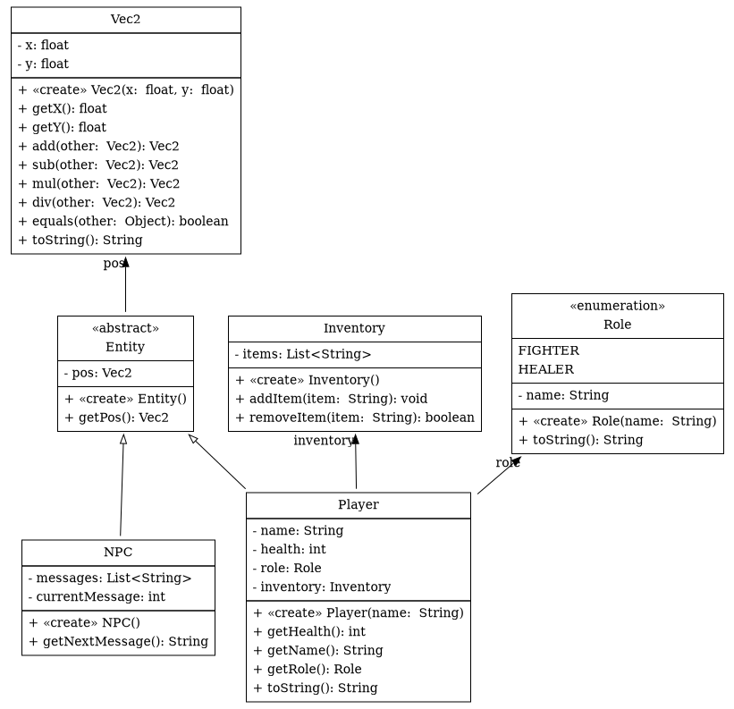
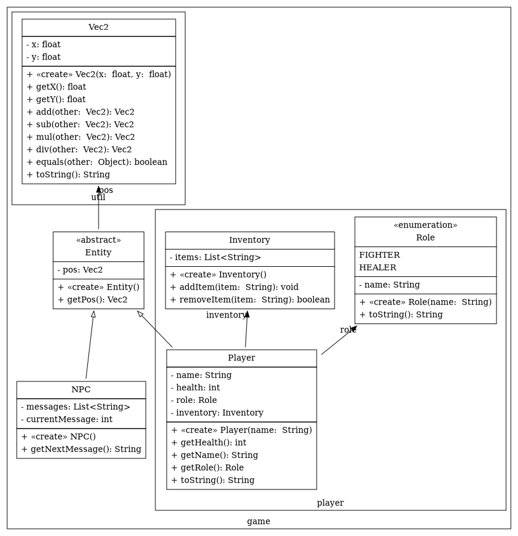
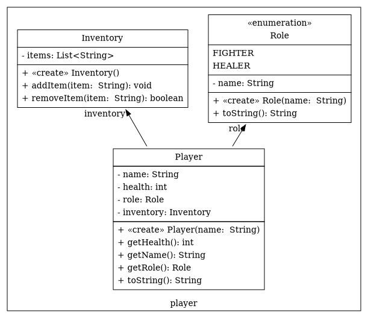
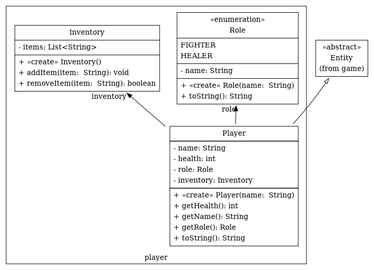

# Better Diagrams

Better Diagrams generates class diagrams from source code.
It aims to provide a unified model for visualizing object oriented architectures based on source code.

Better Diagrams currently supports the following input languages:

- Java
- GraphQL

It can generate the following formats:

- GraphViz: Class Diagrams
- LaTeX: Class Documentation

## Getting Started

Better Diagrams allows you to configure your diagrams in JavaScript.
A simple configuration which shows all classes in a Java project might look like this:

```js
const diagram = Diagram.fromJavaProject("path/to/project")

diagram
  .viewAll()
  .saveGraphViz("graph.gv")
```



If we also want to show the package boundaries, we can use `buildPackageTree` to obtain the package tree for our project.

```js
const packageTree = buildPackageTree(diagram)

diagram
  .view(packageTree)
  .saveGraphViz("graph.gv")
```



A central concept in Better Diagrams is the `View`.
A `View` is a specific subset of a model.
Here we use views to only show the `game.player` package:

```js
diagram
  .view(packageTree.get(["player"]))
  .saveGraphViz("graph.gv")
```



When only showing a single package, we might still want to understand its relationship to other packages.
The `View.withAdjacent` method allows us to show the context around the current view.

```js
diagram
  .view(packageTree.get(["player"]))
  .withAdjacent()                            // Show context
  .saveGraphViz("graph.gv")
```



## License

Copyright 2022 Can Joshua Lehmann

Licensed under the Apache License, Version 2.0 (the "License");
you may not use this file except in compliance with the License.
You may obtain a copy of the License at

    http:/www.apache.org/licenses/LICENSE-2.0

Unless required by applicable law or agreed to in writing, software
distributed under the License is distributed on an "AS IS" BASIS,
WITHOUT WARRANTIES OR CONDITIONS OF ANY KIND, either express or implied.
See the License for the specific language governing permissions and
limitations under the License.
